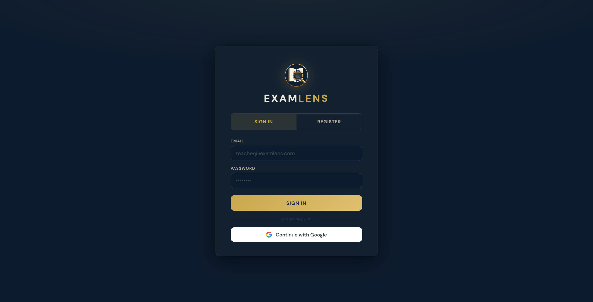
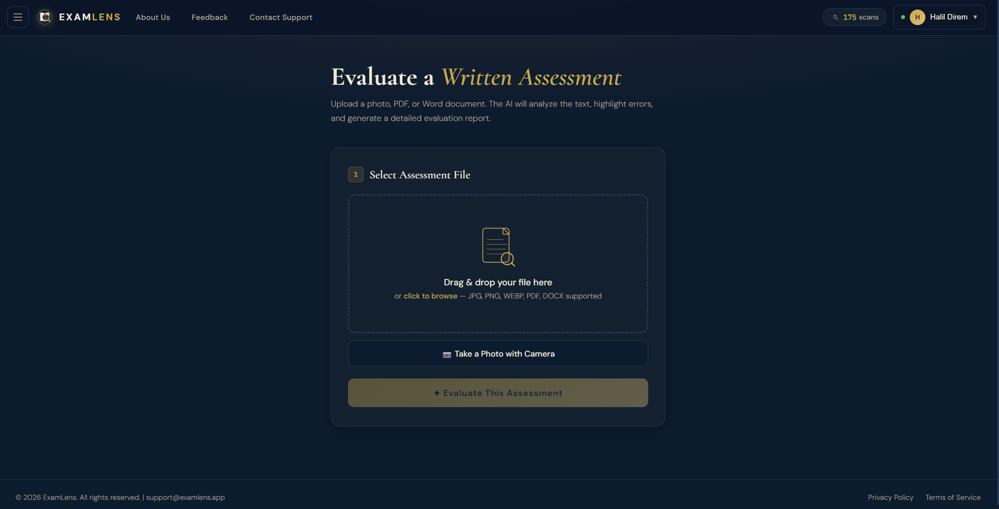
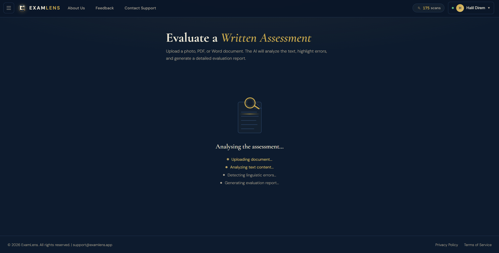
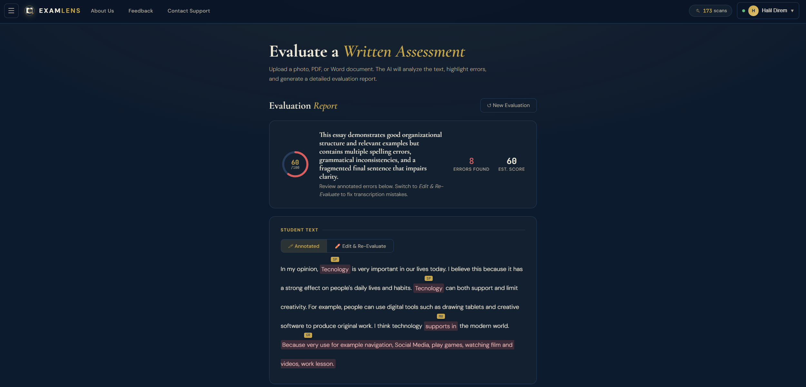
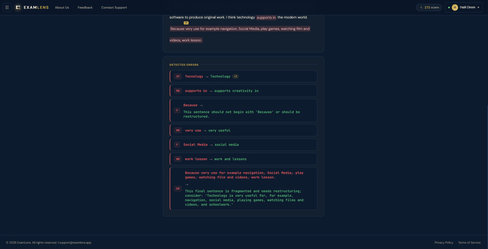

## 🔍 ExamLens – English Writing Paper Evaluator

ExamLens is a full-stack SaaS application built to help English instructors and preparatory schools grade handwritten essays much faster. 
Instead of checking papers manually for hours, teachers can take a photo of the student's essay, upload it, and instantly get a full digital 
transcription with all grammar mistakes highlighted right on the text.

I built this project to solve real-world problems in educational tech, focusing on accurate text extraction and seamless frontend rendering.

**Live Link:** https://www.examlens.app

---

## 📸 Project Screenshots

| 1. Login Screen | 2. Upload Dashboard |
|---|---|
|  |  |

| 3. Evaluating Process | 4. Evaluation Steps |
|---|---|
|  |  |

| 5. Detailed Annotation |
|---|
|  |

---

## 🛠️ Key Features

- **Multi-Category Error Taxonomy:** Automatically detects and marks mistakes like Subject-Verb Agreement (SVA), Word Form, Tense, Articles, and Prepositions.
- **Smart Guardrails:** Protects specific context structures (like "Technology is..." or "Sport is...") so the app never hyper-corrects valid uncountable nouns.
- **Layout Retention:** Preserves original paragraph breaks (`\n\n`) from the paper to keep the reading experience familiar and comfortable for teachers.

---

## 💻 Tech Stack

- **Frontend:** Vanilla JavaScript (ES6+), Semantic HTML5, CSS3 Custom Properties.
- **Backend:** Node.js, Express.js
- **AI Layer:** Anthropic Claude Sonnet API
